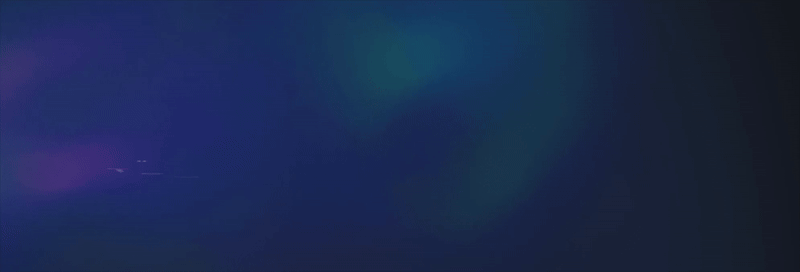

# 📜 Animated Text Loader (Frontend Test)

This project implements a text loading animation inspired by [Dog Studio's "Our Cases" page](https://dogstudio.co/cases/). The animation is built using React, GSAP, and SCSS, with fine-tuned easing, stagger effects, and duration for a smooth, visually engaging experience.

## 🎥 Demo



🔗 [Live Preview](https://tsuyoshitsai.github.io/recruit/polish-design/)

## 🔍 How It Works

1. **Text is split into `<span>` elements** → Allows per-character animation.
2. **GSAP `.from()` applies staggered motion** → Creates smooth entrance effect.
3. **Hover interactions adjust position** → Adds interactive movement.

## 🚀 Tech Stack

- React (UI rendering)
- GSAP (Animation library)
- SCSS (Styling)
- Bun & Vite (Development environment)

## 📂 Installation & Running the Project

1. Clone this repository:

```bash
git clone <repo-url>
cd project-folder
```

2. Install dependencies:

```bash
bun install # or npm install
```

3. Start the development server:

```bash
bun dev  # or npm run dev
```

4. Open `http://localhost:5173` in your browser.

## 🎨 Animation Design

The animation follows these key principles:

- Span Splitting: Each letter is wrapped in a `<span>` to allow independent animations.
- GSAP `.from()` Animation: Starts from an initial offset and transitions smoothly to the final position.
- Staggered Effect (`stagger: 0.015s`): Characters appear in sequence to mimic Dog Studio’s style.
- Easing (`back.out`): Adds a slight bounce to enhance the wave-like motion.

### Duration Calculation

The duration is set to `1.1s` based on the following calculation:

1.  The original text in the Dog Studio example contains 91 characters (including spaces), and the animation duration is `1.255s`.
2.  The text in this project contains 52 characters (including spaces), so the duration is scaled proportionally to `0.717s (52 / 91 * 1.255)`.
3.  Since we are using ease: `back.out(1.7)`, according to [GSAP's documentation](https://gsap.com/docs/v3/Eases/), about 65% of the duration is where the main animation effect occurs, and the remaining 35% is for visual easing.
4.  To ensure the animation completes within the first 0.65 seconds, the final duration is adjusted to `0.717s / 0.65 ≈ 1.1s`.

### Why Not Use GSAP’s SplitText Plugin?

GSAP provides a `SplitText` plugin that automatically breaks text into characters, simplifying animation. However, it's part of the Club GSAP membership, so this project manually splits text into `<span>` elements instead.

## **✨ Interactive Waving Effect on Hover ✨**

An interactive "waving" effect is implemented when the mouse hovers over the text. Here's how it works:

1. When the user moves the mouse over the text, the letters will automatically "bounce" or "wave" outward.
2. The effect is achieved using **GSAP** animations combined with the mouse event trigger. Each letter has its own animation delay to create a more natural, staggered effect.
3. The wave animation adds a playful and dynamic interaction to the text, enhancing the user experience and making the design more engaging.

## 👨‍💻 Author

[Patrick Tsai](https://www.cake.me/ming-hao-tsai)
